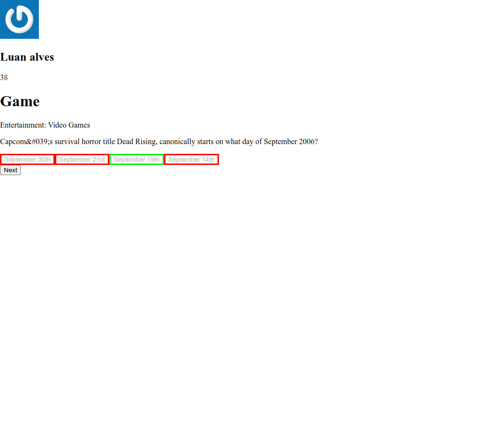

># Game Trivia

## Projeto completo! (Estilização em construção)

## Sobre o projeto
        Este projeto foi desenvolvido no módulo de front-end da Trybe, na data 20/03/2023 
        onde eu e meu grupo, constituído por: @dio1rodrigues, @gabrielmatsuda17, 
        @viniciusvieirac e @MarcosVinicius-iwnl conseguimos colocar em prática os 
        aprendizados até então.
        O projeto é um jogo de perguntas e respostas, onde o usuário digita o nome e email
        para então começar o jogo com perguntas de conhecimento aleatório. O jogo acrescenta
        pontos de acordo com a velocidade da resposta, tendo ranking final com todos os
        ex jogadores.
         

># 🔗 [Acesse clicando aqui!](https://luandersonalvesdev.github.io/game-trivia/#/)

## 👨‍💻 APRENDIZADO
- Trabalhar em equipe usando Scrum.
- Entender e aplicar Kanban de maneira eficaz com Trello.
- Redux thunk para Código assíncrono.
- Testes unitários com Redux e React Router.

## 🛠️ TECNOLOGIAS USADAS 
- React
- Redux
- Redux Thunk
- React Testing Library
- React Router

## CONTATO

https://linkedin.com/in/luandersonalvesdev